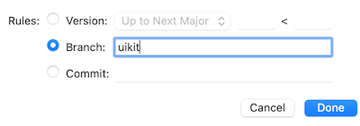

# PaystackCheckout

Improved version of [Paystack](https://github.com/PaystackHQ/checkout-ios)'s checkout for iOS

## Changes

- Added `Metadata` parameter as described in the documentation [here](https://paystack.com/docs/payments/metadata/)
- Support for SwiftUI
- Replaced Alamofire with NSURLSession

## Installation

### Using [Swift Package Manager](https://swift.org/package-manager)

Paystack checkout for iOS is available as a Swift package. Simply add this repo through the swift package manager in Xcode.
>For UIKit, switch to `uikit` branch when installing from swift package manager.



## Usage
### SwiftUI
```swift
import SwiftUI
import PaystackCheckout

struct ContentView: View {
    @State var isPresenting = false
    @State var status = ""

    let transactionParams = TransactionParams(
        amount: 30000,
        email: "user@example.com",
        key: "pk_live_xxxx"
    )

    var body: some View {
        VStack {
            Text(status)
                .padding(.bottom)
            Button("Pay") {
                self.isPresenting.toggle()
            }
            .fullScreenCover(isPresented: $isPresenting, content: {
                PaystackCheckout(params: transactionParams) { (response) in
                    status = response.reference
                } onError: { (error) in
                    status = error?.localizedDescription ?? "an error occured"
                } onDismiss: {
                    status = "dismissed"
                }
            })
        }
    }
}
```

To add `metadata` to your request, simply create an instance of `Metadata` and set the  optional `CustomFields` and `CustomFilters` parameters.
```swift
let customFields = [
    CustomField(variableName: "Invoice ID", value: "209"),
    CustomField(
        displaName: "Cart Items",
        variableName: "cart_items",
        value: "3 bananas, 12 mangoes"
    ),
    CustomField(variableName: "Platform", value: "iOS")
]

let customFilter = CustomFilters(recurring: true, banks: ["057","100"], cardBrands: ["verve"])
let metadata = Metadata(customFields: customFields, customFilters: customFilter)
```
Then pass the metadata object to `PaystackCheckout` view
```swift
PaystackCheckout(params: transactionParams, metadata: metadata) { (response) in
    status = response.reference
} onError: { (error) in
    status = error?.localizedDescription ?? "an error occured"
} onDismiss: {
    status = "dismissed"
}


```

### UIKit
>Make sure you select the `uikit` branch when installing from swift package manager.

Follow the instruction [here](https://github.com/PaystackHQ/checkout-ios)

To add `metadata` to your request, simply create an instance of `Metadata` and set the  optional `CustomFields` and `CustomFilters` parameters.

```swift
let customFields = [
    CustomField(variableName: "Invoice ID", value: "209"),
    ...
]

let customFilter = CustomFilters(recurring: true, banks: ["057","100"], cardBrands: ["verve"])
let metadata = Metadata(customFields: customFields, customFilters: customFilter)

let vc = CheckoutViewController(params: params, metadata: metadata, delegate: self)
present(vc, animated: true)
```

## Credits

[https://github.com/PaystackHQ/checkout-ios](https://github.com/PaystackHQ/checkout-ios)
